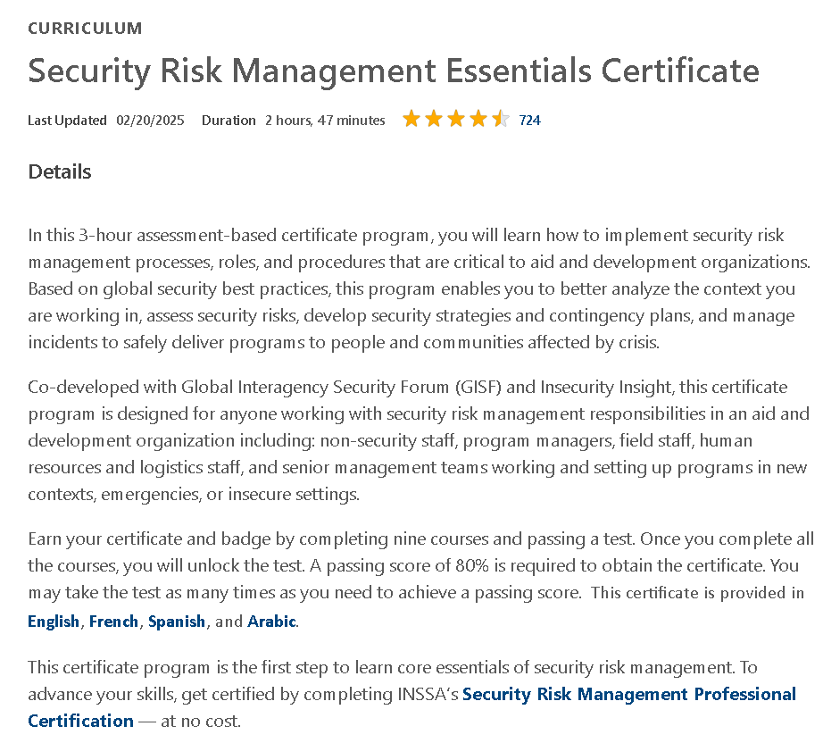

# 🛡️ Security Risk Management Essentials – DisasterReady

This repository documents my learning journey through the **"Security Risk Management Essentials"** course by [DisasterReady.org](https://www.disasterready.org). It includes structured notes, demo reports, security frameworks, and certification evidence.

---

## 📜 Certificate

- 🎓 [Security Risk Management – Certificate](./cert/security-risk-disasterready.pdf)

---

## 🧠 Course Notes (`notes/`)

- [`risk-assessment-models.md`](./notes/risk-assessment-models.md) – Qualitative vs. quantitative models  
- [`humanitarian-contexts.md`](./notes/humanitarian-contexts.md) – Special concerns in NGO field operations  
- [`risk-communication-strategy.md`](./notes/risk-communication-strategy.md) – Stakeholder communication & approval flow  

---

## 🛠️ Demo Reports (`demo/`)

- [`field-risk-log.md`](./demo/field-risk-log.md) – Sample daily incident log in field setting  
- [`regional-risk-scenario.md`](./demo/regional-risk-scenario.md) – Simulated case study of geopolitical tension  
- [`conflict-zone-riskmap.md`](./demo/conflict-zone-riskmap.md) – Map-based risk classification by sector  

---

## 🧭 Response Frameworks (`response-frameworks/`)

- [`incident-escalation-guidelines.md`](./response-frameworks/incident-escalation-guidelines.md)  
- [`post-incident-review-template.md`](./response-frameworks/post-incident-review-template.md)  
- [`partner-data-handling-protocol.md`](./response-frameworks/partner-data-handling-protocol.md)  

---

## 🖼️ Screenshots

| Description             | Image                                      |
|-------------------------|--------------------------------------------|
| 📘 Course Welcome       |     |
| 📚 Curriculum Overview  |  |

---

## 📝 Course Review

This course provides an accessible yet serious overview of risk management principles applied in humanitarian or NGO contexts.

✅ **What I appreciated**:
- Practical examples specific to the nonprofit & disaster relief sector  
- Ethical and people-first framing  
- Structured content with real-world applicability

📌 **What could be improved**:
- Include interactive case simulation  
- Expand on digital security for field teams

---

## ✍️ Author

**Thành Danh** – Cybersecurity Student & NGO Tech Volunteer  
GitHub: [@ngvtdanhh](https://github.com/ngvtdanhh)  
Email: ngvu.thdanh@gmail.com  

---

## 📄 License

This project is licensed under the terms of the **GNU AGPL v3.0**.  
See [`LICENSE`](./LICENSE) for full details.

© 2025 ngvtdanhh. All rights reserved.
